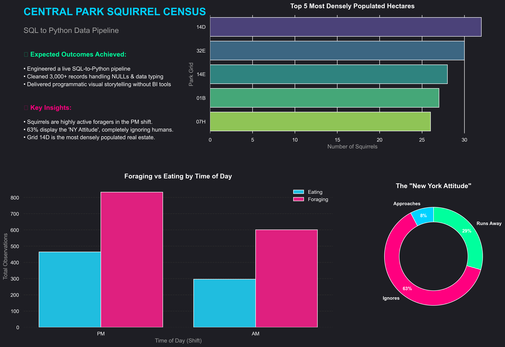

# Central Park Squirrel Census: SQL-to-Python ETL Pipeline

### Project Overview
This project demonstrates a complete end-to-end data pipeline. I took raw wildlife census data, performed heavy data engineering in a **MySQL** environment, and built a custom, programmatic dashboard using **Python**.

### Tech Stack
- **Database:** MySQL (Data Cleaning & Aggregation)
- **Language:** Python (ETL Pipeline & Visualization)
- **Libraries:** Pandas, SQLAlchemy, Seaborn, Matplotlib
- **Tooling:** VS Code, Jupyter Notebooks

### The Data Pipeline
1. **Extraction:** Ingested 3,000+ raw records into a relational database.
2. **Transformation (SQL):** Handled sparse data (NULLs), standardized date strings, and converted text-based booleans into binary integers for mathematical processing.
3. **Visualization (Python):** Established a live SQLAlchemy connection to bypass manual exports and rendered a custom UI using `GridSpec` for precise layout control.

###  Key Insights
- **The "NY Attitude":** 63% of squirrels completely ignored human presence.
- **Peak Activity:** Foraging and eating behaviors spike significantly during the PM shift.
- **Top Real Estate:** Hectare 14D is the most densely populated grid in Central Park.

